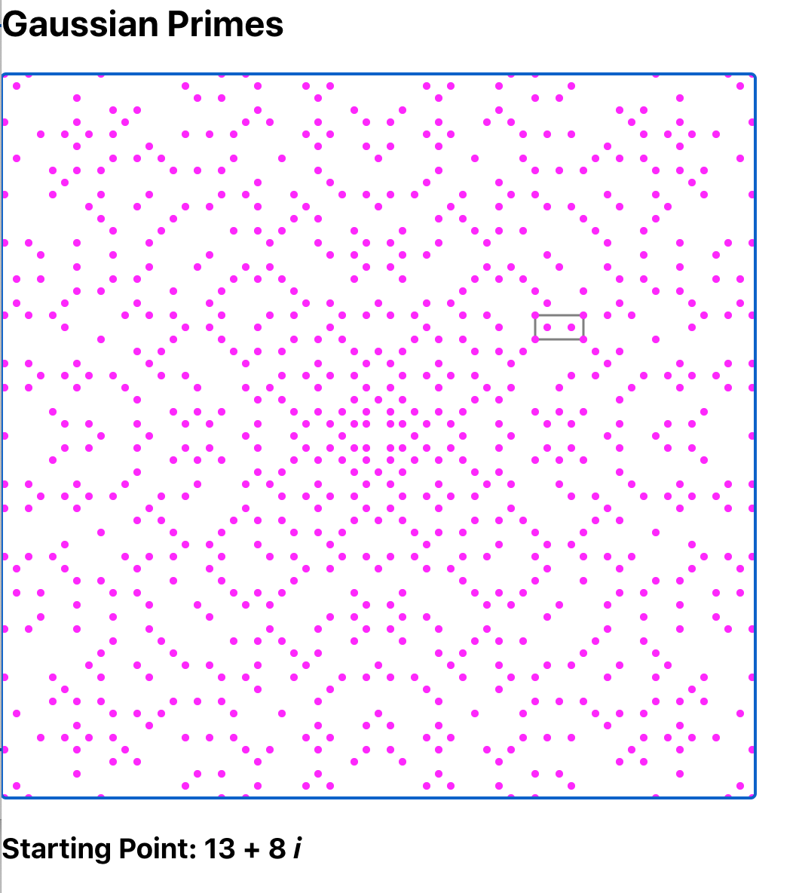
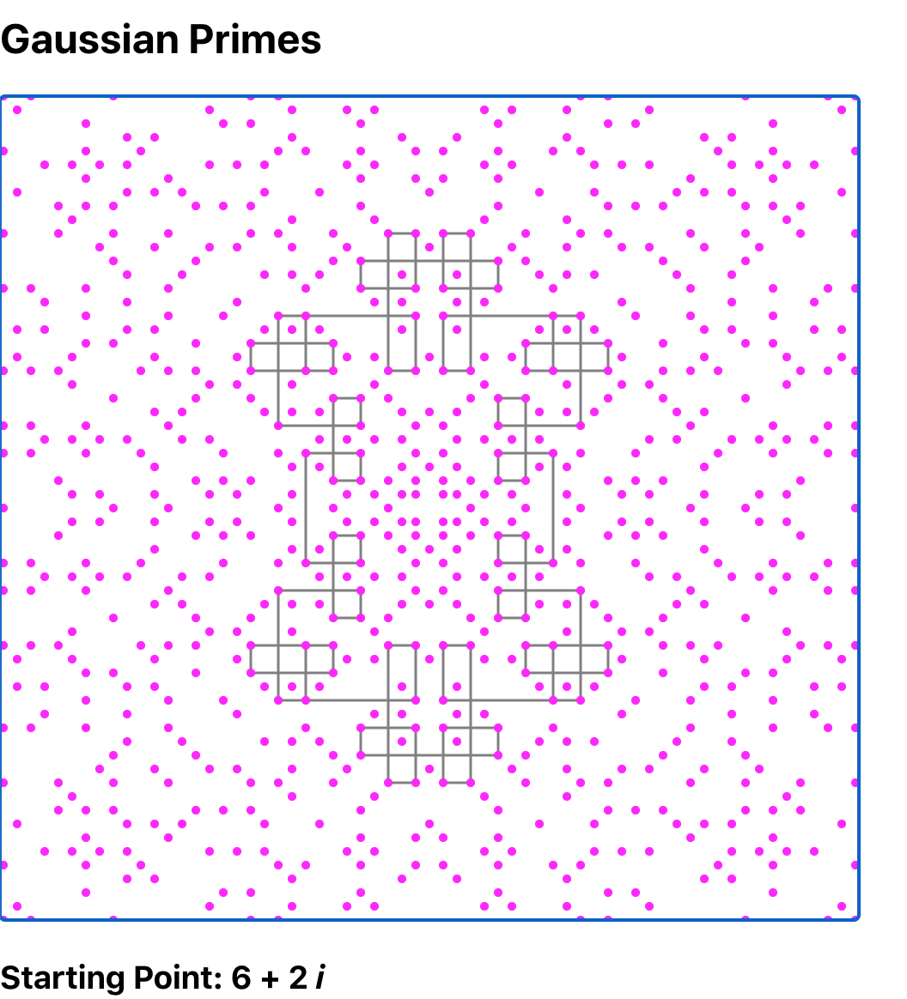
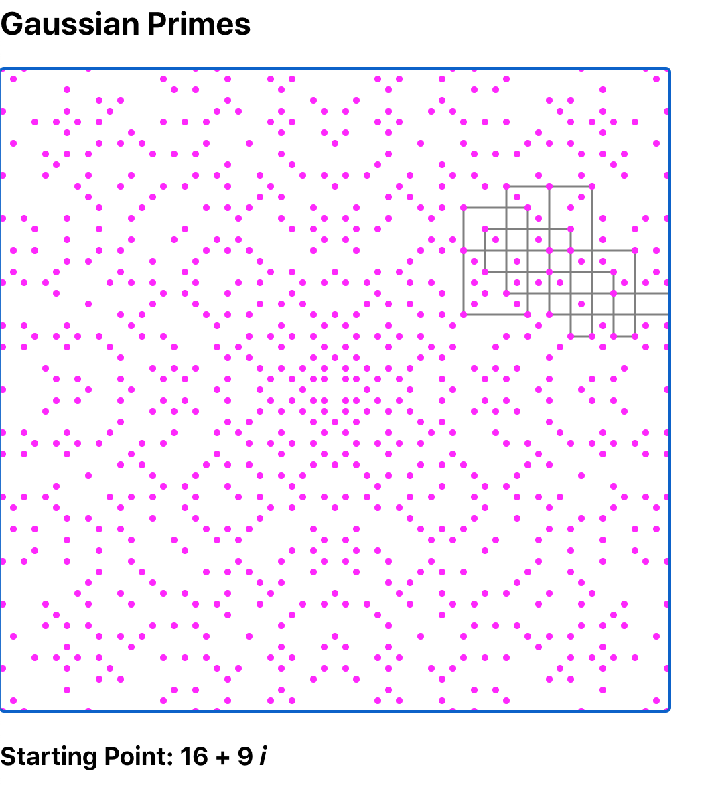

An interactive toy for exploring the patterns described in [this blog post by John D Cook](https://www.johndcook.com/blog/2020/09/24/gaussian_integer_walk/).

A little background. A [Gaussian integer](https://en.wikipedia.org/wiki/Gaussian_integer) is basically a complex number where both the real and imaginary component are integers. Gaussian primes are a factorization domain in the Gaussian integers. That means that they behave similarly to the "regular" prime numbers.

The Gaussian primes have a number of interesting patterns & properties, such as the ones described in [this paper](https://www.maa.org/sites/default/files/pdf/upload_library/22/Chauvenet/Gethner.pdf). The one this widget is exploring is the following.

* Pick a Gaussian integer
* Start moving in the +X direction
* When you hit a Gaussian prime, turn left 90 degrees
* Continue until you reach the starting point

As far as anyone knows, the resulting patterns always appear to return to the starting point. In many cases, they do that with a simple rectangle.

But sometimes they wander for quite a while before returning.

They're usually symmetric, but not always.

I thought this was pretty fascinating, so I created this simple React page to play with it. You can run it [here](https://rustytriangles.github.io/gaussian_primes/). Try clicking different locations. You can zoom in and out (a little bit) using the + and - keys.

